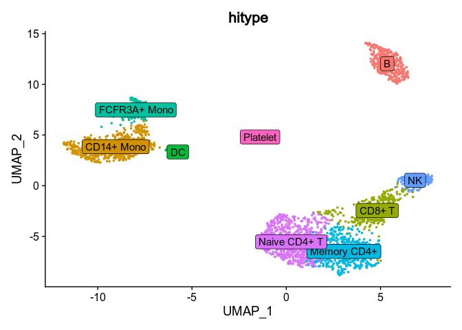

<!-- README.md is generated from README.Rmd. Please edit that file -->

# hitype <a href="https://pwwang.github.io/hitype/"></a>

<!-- badges: start -->
<!-- badges: end -->

**Hi**erarchical and **hi**gh-resolution cell-type identification for
single-cell RNA-seq data inspired by
[ScType](https://github.com/IanevskiAleksandr/sc-type).

## Features

-   [x] Compatibility with
    [ScType](https://github.com/IanevskiAleksandr/sc-type)
-   [x] Hierarchical and high-resolution cell-type identification
-   [x] Train weights for your markers with a reference dataset
-   [x] Speed optimization
-   [x] Support as an R package with unit tests

## Installation

You can install the development version of `hitype` like so:

``` r
if (!requireNamespace("devtools", quietly = TRUE)) {
    install.packages("devtools")
}
devtools::install_github("pwwang/hitype")
```

## Quick start

### Prepare the dataset

See also
<https://satijalab.org/seurat/articles/pbmc3k_tutorial.html#setup-the-seurat-object>

<details>
<summary>
Click to expand
</summary>

``` r
pbmc <- pbmc3k.SeuratData::pbmc3k
pbmc[["percent.mt"]] <- Seurat::PercentageFeatureSet(pbmc, pattern = "^MT-")
pbmc <- subset(pbmc, subset = nFeature_RNA > 200 & nFeature_RNA < 2500 & percent.mt < 5)
pbmc <- Seurat::NormalizeData(pbmc)
pbmc <- Seurat::FindVariableFeatures(pbmc, selection.method = "vst", nfeatures = 2000)
pbmc <- Seurat::ScaleData(pbmc, features = rownames(pbmc))
pbmc <- Seurat::RunPCA(pbmc, features = Seurat::VariableFeatures(object = pbmc))
pbmc <- Seurat::FindNeighbors(pbmc, dims = 1:10)
pbmc <- Seurat::FindClusters(pbmc, resolution = 0.5)
#> Modularity Optimizer version 1.3.0 by Ludo Waltman and Nees Jan van Eck
#> 
#> Number of nodes: 2638
#> Number of edges: 95927
#> 
#> Running Louvain algorithm...
#> Maximum modularity in 10 random starts: 0.8728
#> Number of communities: 9
#> Elapsed time: 0 seconds
pbmc <- Seurat::RunUMAP(pbmc, dims = 1:10)
```

</details>

### Use as a Seurat extension

``` r
library(hitype)

# Load gene sets
gs <- gs_prepare(hitypedb_pbmc3k)

# Assign cell types
obj <- RunHitype(pbmc, gs)

Seurat::DimPlot(obj, group.by = "hitype", label = TRUE, label.box = TRUE) +
  Seurat::NoLegend()
```



Compared to the manual marked cell types: 

See also
<https://satijalab.org/seurat/articles/pbmc3k_tutorial.html#assigning-cell-type-identity-to-clusters>

### Use as standalone functions

``` r
scores <- hitype_score(pbmc@assays$RNA@scale.data, gs, scaled = TRUE)
cell_types <- hitype_assign(pbmc$seurat_clusters, scores, gs)
summary(cell_types)
#> # A tibble: 9 × 4
#>   Level Cluster CellType     Score
#>   <int> <fct>   <chr>        <dbl>
#> 1     1 0       Naive CD4+ T 0.104
#> 2     1 1       CD14+ Mono   0.162
#> 3     1 2       Memory CD4+  0.114
#> 4     1 3       B            0.139
#> 5     1 4       CD8+ T       0.190
#> 6     1 5       FCFR3A+ Mono 0.366
#> 7     1 6       NK           0.256
#> 8     1 7       DC           0.559
#> 9     1 8       Platelet     0.973
```

You may see that we have exactly the same assignment in the Seurat
tutorial:

| Cluster ID | Markers       | Cell Type    |
|:-----------|:--------------|:-------------|
| 0          | IL7R, CCR7    | Naive CD4+ T |
| 1          | CD14, LYZ     | CD14+ Mono   |
| 2          | IL7R, S100A4  | Memory CD4+  |
| 3          | MS4A1         | B            |
| 4          | CD8A          | CD8+ T       |
| 5          | FCGR3A, MS4A7 | FCGR3A+ Mono |
| 6          | GNLY, NKG7    | NK           |
| 7          | FCER1A, CST3  | DC           |
| 8          | PPBP          | Platelet     |

## Documentation

<https://pwwang.github.io/hitype/>
