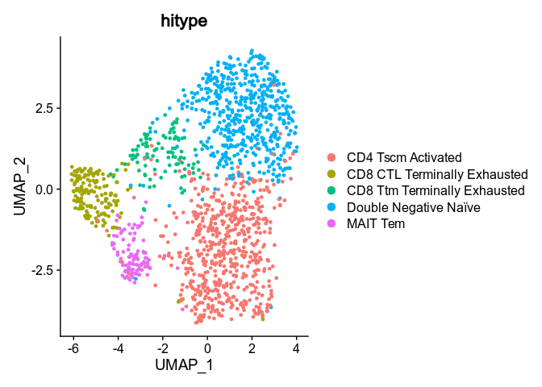
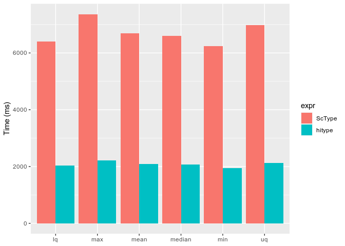

<!-- README.md is generated from README.Rmd. Please edit that file -->

# hitype

<!-- badges: start -->
<!-- badges: end -->

**Hi**erarchical and **hi**gh-resolution cell-type identification for
single-cell RNA-seq data based on
[ScType](https://github.com/IanevskiAleksandr/sc-type).

## Features

-   [x] Compatibility with
    [ScType](https://github.com/IanevskiAleksandr/sc-type)
-   [x] Hierarchical and high-resolution cell-type identification
-   [x] Speed optimization
-   [x] Support as an R package with unit tests

## Installation

You can install the development version of hitype like so:

``` r
if (!requireNamespace("devtools", quietly = TRUE)) {
    install.packages("devtools")
}
devtools::install_github("pwwang/hitype")
```

## Quick start

### Use as a Seurat extension

``` r
library(hitype)

# Load gene sets
gs <- gs_prepare(hitypedb_tcell)

# Load seurat object
pbmc3kt <- readRDS(url(
  "https://www.dropbox.com/scl/fi/pyizrlwuklt6g9yrgf51p/pbmc3kt.rds?rlkey=fz6t9qqjjf5n8dr08vv6rhyye&dl=1"
))

# Assign cell types
obj <- RunHitype(pbmc3kt, gs)

Seurat::DimPlot(obj, group.by = "hitype")
```



### Use as a standalone function

``` r
scores <- hitype_score(pbmc3kt@assays$RNA@scale.data, gs, scaled = TRUE)
cell_types <- hitype_assign(pbmc3kt$seurat_clusters, scores, gs)
summary(cell_types)
#> # A tibble: 5 × 3
#>   Cluster CellType                     Score
#>   <fct>   <chr>                        <dbl>
#> 1 0       CD4 Tscm Activated           0.321
#> 2 1       Double Negative Naïve        0.307
#> 3 2       CD8 CTL Terminally Exhausted 0.415
#> 4 3       CD8 Ttm Terminally Exhausted 0.313
#> 5 4       MAIT Tem                     0.415
```

## Usage

### `hitype` is compatible with `ScType`

Loading packages:

``` r
lapply(
  c("dplyr","Seurat","HGNChelper","openxlsx"),
  library,
  character.only = T,
  quietly = T
)
#> [[1]]
#> [1] "dplyr"     "hitype"    "stats"     "graphics"  "grDevices" "utils"    
#> [7] "datasets"  "methods"   "base"     
#> 
#> [[2]]
#>  [1] "SeuratObject" "Seurat"       "dplyr"        "hitype"       "stats"       
#>  [6] "graphics"     "grDevices"    "utils"        "datasets"     "methods"     
#> [11] "base"        
#> 
#> [[3]]
#>  [1] "HGNChelper"   "SeuratObject" "Seurat"       "dplyr"        "hitype"      
#>  [6] "stats"        "graphics"     "grDevices"    "utils"        "datasets"    
#> [11] "methods"      "base"        
#> 
#> [[4]]
#>  [1] "openxlsx"     "HGNChelper"   "SeuratObject" "Seurat"       "dplyr"       
#>  [6] "hitype"       "stats"        "graphics"     "grDevices"    "utils"       
#> [11] "datasets"     "methods"      "base"

# load sc-type
source("https://raw.githubusercontent.com/IanevskiAleksandr/sc-type/master/R/gene_sets_prepare.R")
source("https://raw.githubusercontent.com/IanevskiAleksandr/sc-type/master/R/sctype_score_.R")
```

``` r
# scores by ScType

# get cell-type-specific gene sets from our in-built database (DB)
gs_list = gene_sets_prepare(
  "https://raw.githubusercontent.com/IanevskiAleksandr/sc-type/master/ScTypeDB_short.xlsx",
  "Immune system"
)

# calculate cell type scores
scRNAseqData = readRDS(gzcon(url(
  'https://raw.githubusercontent.com/IanevskiAleksandr/sc-type/master/exampleData.RDS'
)))
es.max = sctype_score(
  scRNAseqData = scRNAseqData,
  scaled = TRUE,
  gs = gs_list$gs_positive,
  gs2 = gs_list$gs_negative
)
es.max[1:5, 1:3]
#>                  AAACATACAACCAC-1 AAACATTGAGCTAC-1 AAACATTGATCAGC-1
#> Pro-B cells            -0.8348617         1.584958       -0.8348617
#> Pre-B cells            -0.8394849         1.774219       -0.8394849
#> Immature B cells       -0.9172371         2.177044       -0.8598132
#> Naive B cells          -1.0375502         2.540720       -1.0375502
#> Memory B cells         -1.0375502         2.540720       -1.0375502
```

``` r
# scores by hitype
library(hitype)

# load gene sets
gs = gs_prepare(
  "https://raw.githubusercontent.com/IanevskiAleksandr/sc-type/master/ScTypeDB_short.xlsx",
  "Immune system"
)

# calculate cell type scores
es.scores = suppressWarnings(hitype_score(scRNAseqData, gs, scaled = TRUE))
es.scores[[1]][rownames(es.max)[1:5], colnames(es.max)[1:3]]
#>                  AAACATACAACCAC-1 AAACATTGAGCTAC-1 AAACATTGATCAGC-1
#> Pro-B cells            -0.8348617         1.584958       -0.8348617
#> Pre-B cells            -0.8394849         1.774219       -0.8394849
#> Immature B cells       -0.9172371         2.177044       -0.8598132
#> Naive B cells          -1.0375502         2.540720       -1.0375502
#> Memory B cells         -1.0375502         2.540720       -1.0375502
```

You can see that the results are the same.

### `hitype` is faster for large datasets

``` r
# speed comparison
library(ggplot2)
library(tidyr)
library(microbenchmark)

exprs <- scRNAseqData[, rep(colnames(scRNAseqData), 10)]

bm <- microbenchmark(
  ScType = sctype_score(
    scRNAseqData = exprs,
    scaled = TRUE,
    gs = gs_list$gs_positive,
    gs2 = gs_list$gs_negative
  ),
  hitype = hitype_score(exprs, gs, scaled = TRUE),
  times = 10,
  unit = "ms"
)%>%
  summary() %>%
  pivot_longer(cols = -c("expr", "neval"), names_to = "measure", values_to = "time")

ggplot(bm, aes(x = measure, y = time, fill = expr)) +
  geom_col(position = "dodge") +
  labs(x = NULL, y = "Time (ms)")
```


