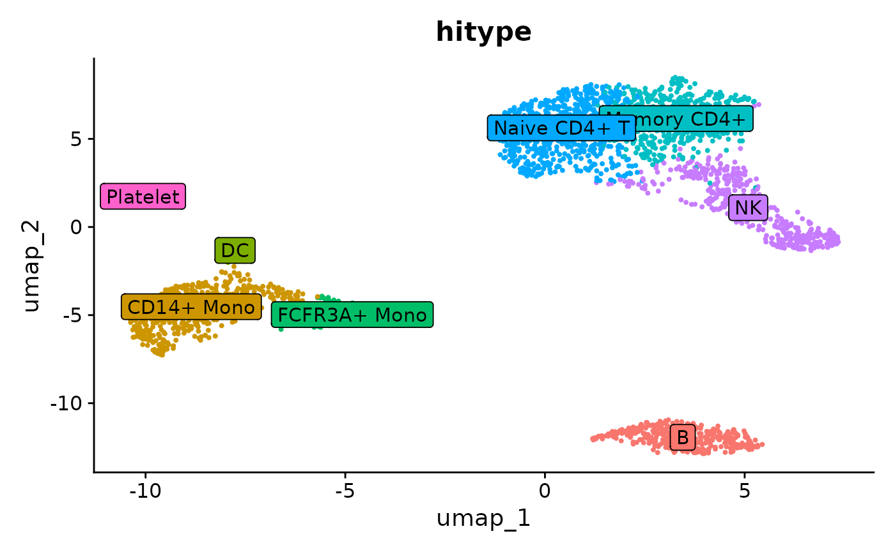

# Calculate cell type scores and assign cell types

``` r
library(hitype)
```

## Using `RunHitype` on `Seurat` object

Prepare the seurat object:

See also
<https://satijalab.org/seurat/articles/pbmc3k_tutorial.html#setup-the-seurat-object>

``` r
suppressWarnings(SeuratData::InstallData("pbmc3k"))
pbmc <- pbmc3k.SeuratData::pbmc3k
pbmc <- Seurat::UpdateSeuratObject(pbmc)
pbmc[["percent.mt"]] <- Seurat::PercentageFeatureSet(pbmc, pattern = "^MT-")
pbmc <- subset(pbmc, subset = nFeature_RNA > 200 & nFeature_RNA < 2500 & percent.mt < 5)
pbmc <- Seurat::NormalizeData(pbmc)
pbmc <- Seurat::FindVariableFeatures(pbmc, selection.method = "vst", nfeatures = 2000)
pbmc <- Seurat::ScaleData(pbmc, features = rownames(pbmc))
pbmc <- Seurat::RunPCA(pbmc, features = Seurat::VariableFeatures(object = pbmc))
pbmc <- Seurat::FindNeighbors(pbmc, dims = 1:10)
pbmc <- Seurat::FindClusters(pbmc, resolution = 0.5)
#> Modularity Optimizer version 1.3.0 by Ludo Waltman and Nees Jan van Eck
#> 
#> Number of nodes: 2638
#> Number of edges: 95927
#> 
#> Running Louvain algorithm...
#> Maximum modularity in 10 random starts: 0.8728
#> Number of communities: 9
#> Elapsed time: 0 seconds
pbmc <- Seurat::RunUMAP(pbmc, dims = 1:10)
```

``` r
library(hitype)

markers <- data.frame(
    cellName = c(
        "Naive CD4+ T", "CD14+ Mono", "Memory CD4+", "B",
        "CD8+ T", "FCFR3A+ Mono", "NK", "DC", "Platelet"
    ),
    geneSymbolmore1 = c(
        "IL7R,CCR7",  "CD14,LYZ", "IL7R,S100A4", "MS4A1",
        "CD8A", "FCGR3A,MS4A7", "GNLY,NKG7", "FCER1A,CST3", "PPBP"
    ),
    geneSymbolmore2 = rep("", 9)
)

# Load gene sets
gs <- gs_prepare(markers)

# Assign cell types
obj <- RunHitype(pbmc, gs)

Seurat::DimPlot(obj, group.by = "hitype", label = TRUE, label.box = TRUE) +
  Seurat::NoLegend()
```



Compared to the manual marked cell types:


Seurat manual marked cell types

See also
<https://satijalab.org/seurat/articles/pbmc3k_tutorial.html#assigning-cell-type-identity-to-clusters>

## Using `hitype_score` and `hitype_assign` on `Seurat` directly

By default,
[`hitype_score()`](https://pwwang.github.io/hitype/reference/hitype_score.md)
expects log-normalized data (`scaled = FALSE`) and performs its own
z-scoring. In Seurat v5, access the normalized data with
`Seurat::GetAssayData(pbmc, layer = "data")`:

``` r
scores <- hitype_score(Seurat::GetAssayData(pbmc, layer = "data"), gs)
cell_types <- hitype_assign(pbmc$seurat_clusters, scores, gs)
summary(cell_types)
#> # A tibble: 9 × 5
#>   Level Cluster CellType      Score  Margin
#>   <int> <fct>   <chr>         <dbl>   <dbl>
#> 1     1 0       Naive CD4+ T  0.721  0.685 
#> 2     1 1       CD14+ Mono    2.28   1.20  
#> 3     1 2       Memory CD4+   0.599  0.0927
#> 4     1 3       B             2.09   2.17  
#> 5     1 4       NK            1.43   0.179 
#> 6     1 5       FCFR3A+ Mono  3.42   2.44  
#> 7     1 6       NK            3.91   2.88  
#> 8     1 7       DC            5.55   4.59  
#> 9     1 8       Platelet     11.5   11.3
```

If you prefer to pass pre-scaled data (e.g. from a Seurat `scale.data`
layer), use `scaled = TRUE`:

``` r
scores <- hitype_score(Seurat::GetAssayData(pbmc, layer = "scale.data"),
                       gs, scaled = TRUE)
```

When scoring with **learned weights** (see
[`vignette("train-marker-weights")`](https://pwwang.github.io/hitype/articles/train-marker-weights.md)),
use `norm = "weight", use_sensitivity = FALSE` so that scores are
normalized by the total marker weight and shared markers are not
double-penalized:

``` r
scores <- hitype_score(Seurat::GetAssayData(pbmc, layer = "data"), gs,
                       norm = "weight", use_sensitivity = FALSE)
```

compare to the manual marked cell types:

| Cluster ID | Markers       | Cell Type    |
|:-----------|:--------------|:-------------|
| 0          | IL7R, CCR7    | Naive CD4+ T |
| 1          | CD14, LYZ     | CD14+ Mono   |
| 2          | IL7R, S100A4  | Memory CD4+  |
| 3          | MS4A1         | B            |
| 4          | CD8A          | CD8+ T       |
| 5          | FCGR3A, MS4A7 | FCGR3A+ Mono |
| 6          | GNLY, NKG7    | NK           |
| 7          | FCER1A, CST3  | DC           |
| 8          | PPBP          | Platelet     |

See:
<https://satijalab.org/seurat/articles/pbmc3k_tutorial.html#assigning-cell-type-identity-to-clusters>

## Exploring the result of `hitype_assign`

The result of `hitype_assign` is a `data.frame` with the following
columns:

- `Level`: the level of the cell type in the hierarchy
- `Cluster`: the cluster ID
- `CellType`: the cell type name
- `Score`: the score of the cell type

``` r
head(cell_types)
#> # A tibble: 1 × 5
#>   Level Cluster CellType     Score Margin
#>   <int> <fct>   <chr>        <dbl>  <dbl>
#> 1     1 0       Naive CD4+ T 0.721  0.685
```
