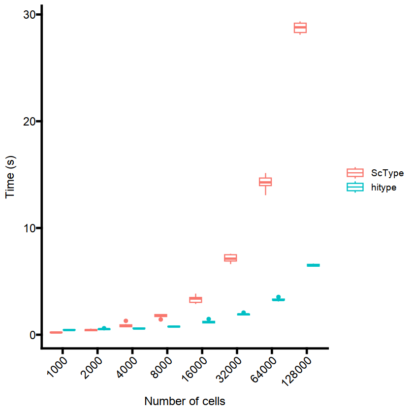

```{r, include = FALSE}
knitr::opts_chunk$set(
  collapse = TRUE,
  comment = "#>"
)
```

```{r setup,warning=FALSE, message=FALSE}
suppressPackageStartupMessages(library(dplyr))
suppressPackageStartupMessages(library(Seurat))
suppressPackageStartupMessages(library(HGNChelper))
suppressPackageStartupMessages(library(openxlsx))
suppressPackageStartupMessages(library(ggplot2))
suppressPackageStartupMessages(library(tidyr))
suppressPackageStartupMessages(library(hitype))
suppressPackageStartupMessages(library(microbenchmark))

# load sc-type
source("https://raw.githubusercontent.com/IanevskiAleksandr/sc-type/master/R/gene_sets_prepare.R")
source("https://raw.githubusercontent.com/IanevskiAleksandr/sc-type/master/R/sctype_score_.R")

scRNAseqData <- readRDS(gzcon(url(
  'https://raw.githubusercontent.com/IanevskiAleksandr/sc-type/master/exampleData.RDS'
)))

rownames(scRNAseqData) <- toupper(rownames(scRNAseqData))

# Gene sets for ScType
gs_list = suppressWarnings(gene_sets_prepare(
  "https://raw.githubusercontent.com/IanevskiAleksandr/sc-type/master/ScTypeDB_short.xlsx",
  "Immune system"
))

# Gene sets for hitype
gs = suppressWarnings(gs_prepare(hitypedb_short, "Immune system"))

# Prepare expression matrix for different number of cells
all_cells <- colnames(scRNAseqData)
exprs1000c <- scRNAseqData[, sample(all_cells, 1000, replace = TRUE)]
exprs2000c <- scRNAseqData[, sample(all_cells, 2000, replace = TRUE)]
exprs4000c <- scRNAseqData[, sample(all_cells, 4000, replace = TRUE)]
exprs8000c <- scRNAseqData[, sample(all_cells, 8000, replace = TRUE)]
exprs16000c <- scRNAseqData[, sample(all_cells, 16000, replace = TRUE)]
exprs32000c <- scRNAseqData[, sample(all_cells, 32000, replace = TRUE)]
exprs64000c <- scRNAseqData[, sample(all_cells, 64000, replace = TRUE)]
exprs128000c <- scRNAseqData[, sample(all_cells, 128000, replace = TRUE)]
```

```{r, warning=FALSE, eval=FALSE}

bm <- suppressWarnings(microbenchmark(
  ScType_1000 = sctype_score(
    scRNAseqData = exprs1000c,
    scaled = TRUE,
    gs = gs_list$gs_positive,
    gs2 = gs_list$gs_negative
  ),
  ScType_2000 = sctype_score(
    scRNAseqData = exprs2000c,
    scaled = TRUE,
    gs = gs_list$gs_positive,
    gs2 = gs_list$gs_negative
  ),
  ScType_4000 = sctype_score(
    scRNAseqData = exprs4000c,
    scaled = TRUE,
    gs = gs_list$gs_positive,
    gs2 = gs_list$gs_negative
  ),
  ScType_8000 = sctype_score(
    scRNAseqData = exprs8000c,
    scaled = TRUE,
    gs = gs_list$gs_positive,
    gs2 = gs_list$gs_negative
  ),
  ScType_16000 = sctype_score(
    scRNAseqData = exprs16000c,
    scaled = TRUE,
    gs = gs_list$gs_positive,
    gs2 = gs_list$gs_negative
  ),
  ScType_32000 = sctype_score(
    scRNAseqData = exprs32000c,
    scaled = TRUE,
    gs = gs_list$gs_positive,
    gs2 = gs_list$gs_negative
  ),
  ScType_64000 = sctype_score(
    scRNAseqData = exprs64000c,
    scaled = TRUE,
    gs = gs_list$gs_positive,
    gs2 = gs_list$gs_negative
  ),
  ScType_128000 = sctype_score(
    scRNAseqData = exprs128000c,
    scaled = TRUE,
    gs = gs_list$gs_positive,
    gs2 = gs_list$gs_negative
  ),
  hitype_1000 = hitype_score(exprs1000c, gs, scaled = TRUE),
  hitype_2000 = hitype_score(exprs2000c, gs, scaled = TRUE),
  hitype_4000 = hitype_score(exprs4000c, gs, scaled = TRUE),
  hitype_8000 = hitype_score(exprs8000c, gs, scaled = TRUE),
  hitype_16000 = hitype_score(exprs16000c, gs, scaled = TRUE),
  hitype_32000 = hitype_score(exprs32000c, gs, scaled = TRUE),
  hitype_64000 = hitype_score(exprs64000c, gs, scaled = TRUE),
  hitype_128000 = hitype_score(exprs128000c, gs, scaled = TRUE),
  times = 10,
  unit = "ms"
))

```

Plot the results:

```{r, eval=FALSE}
theme_set(ggprism::theme_prism(axis_text_angle = 45))

bm = bm %>% mutate(
  tool = if_else(grepl("ScType", expr), "ScType", "hitype"),
  ncells = as.numeric(stringr::str_extract(expr, "\\d+")),
  time = time / 1e9
) %>%
  ggplot(aes(x = as.factor(ncells), y = time, color = tool)) +
  geom_boxplot() +
  labs(x = "Number of cells", y = "Time (s)")
```


